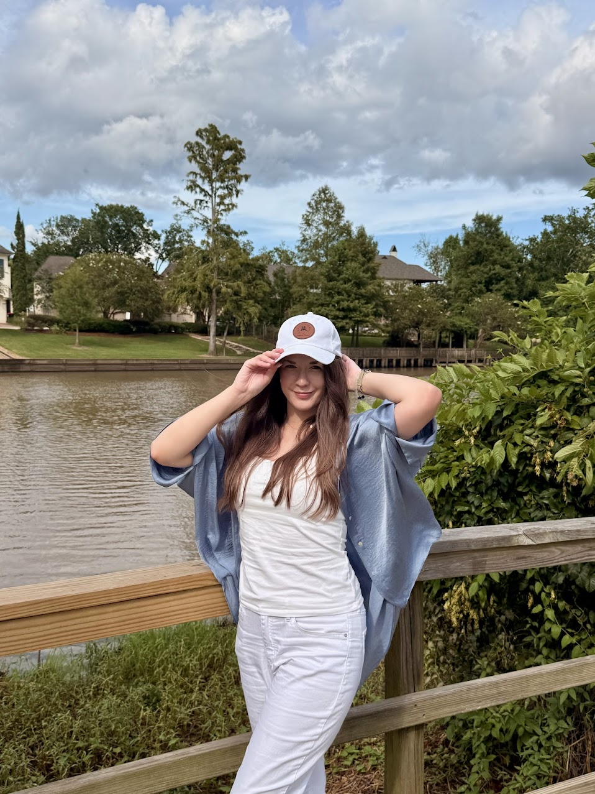
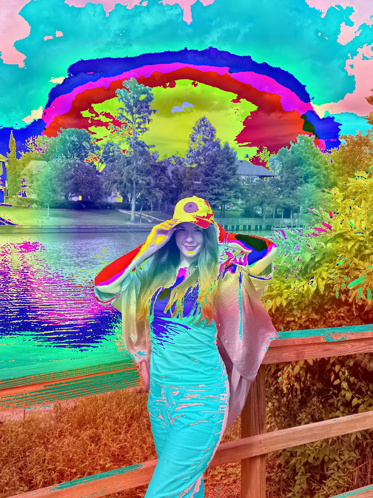
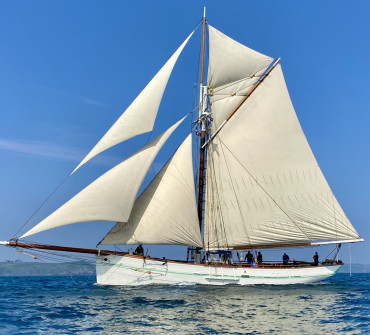
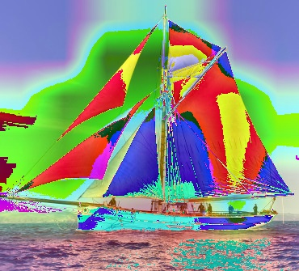
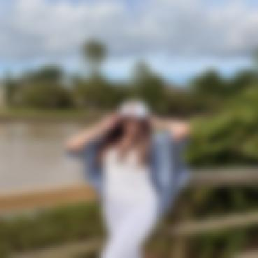
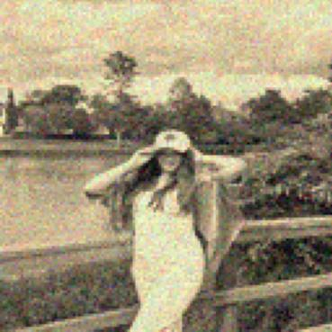
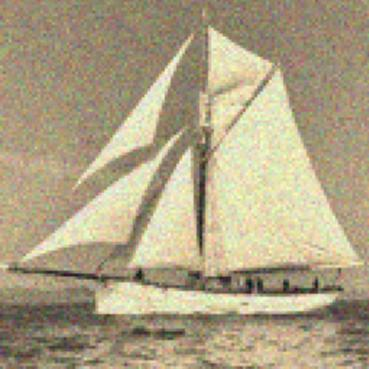

# Reflection

## Image Classifications and Processing

After setting up my virtual environment while following along with the lecture, I was running into an issue with tensorflow.keras. This showed up with attempting to apply the GradCAM heatmap to my chosen image. I searched for a smaller image and it still threw the same exceptions. I went back and ran the same images through the example classifier code. The same execptions were being thrown, however, the code was able to successfully save the heatmap images to open seperately. The first image was of my girlfriend and it had a higher resolution. Below is the image and the classification results.

Top-3 Predictions for Sandra@Ruffinos.jpg
- 1: binoculars (0.10)
- 2: suspension_bridge (0.10)
- 3: jean (0.09)

With the image being larger than the axlotl example, GradCAM appears to be focussing on many aspects of the image at once. The attention was spread, mainly, between Sandra and the clouds. 

I found a second image that I hoped the AI would have an easier time identifying. The image is of a typical sail boat on then water and was significantly smaller than my first image.

Top-3 Predictions for sail_boat.jpg:
- 1: schooner (0.69)
- 2: yawl (0.14)
- 3: trimaran (0.02)

Not only did the AI successfully identify that it was a sail boat, it was trying to identify the specific class of vessel!

## Image Filtering

For my filtering part of this project, I did not run into any dependencies or import issues. the Gaussian Blur filter worked perfectly on both images

I decided to try and replication the color and texture of an old style photopraph for my custom filter. It applies a sepia tone while adding a sort of film grain to the images.

